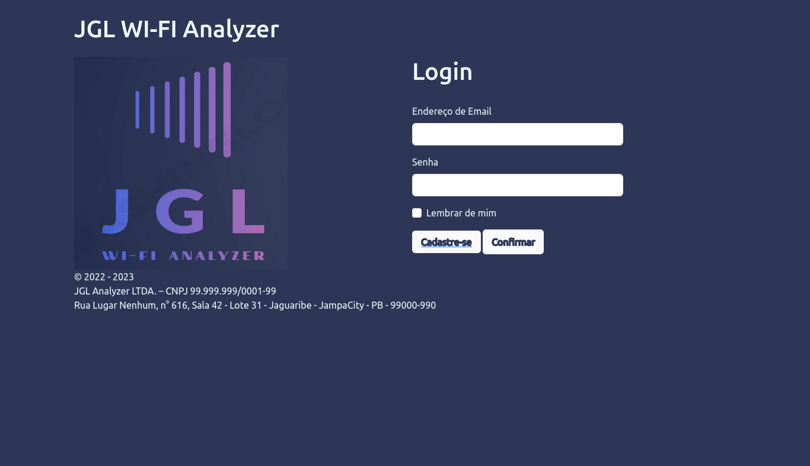
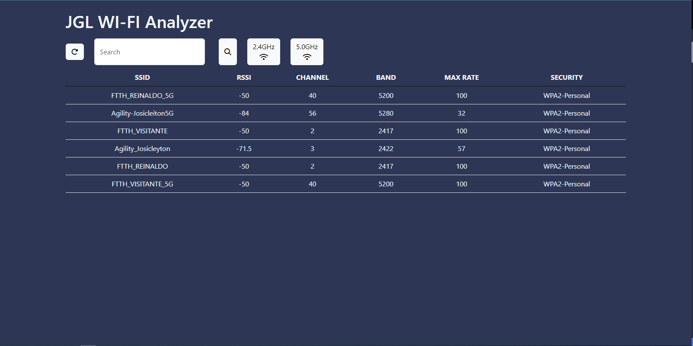

# ProjetoDW - JGL Wi-fi Analyzer

## Descrição do projeto
- Site para a captura das redes Wi-Fi com recursos que possibilitam uma analise detalhada das redes disponíveis.

## Requisitos mínimos
- Para executar: Uma máquina windows para rodar o servidor e um navegador para acesso e visualização;
- Se o site for disponibilizado, apenas um navegador para o acesso.

## Processo de instalação
- É necessario a instalação do VS code ou similar para a leitura do código, a partir daí temos que instalar o bootstrap, node js, prisma;
- E as extensões: Prisma, Live Server, SQLite Viewer, Docker.

## Inspirações de Funcionalidade

- O nosso projeto foi inspirado no aplicativo Wifi Analyzer, tivemos o objetivo de viabilizar a captura das redes de wifi direto do site na web.

## Telas

## Descrição das Funcionalidades do Projeto
- Na página de login o usuário pode entrar no site ou ir para a página de cadastro;
- Na página de cadastro o usuário faz o seu cadastro que será armazenado no back;
- Na página principal o usuário pode verificar as redes disponíveis, analisar as informações dispostas entre outros.

## Contatos
- Guilherme Lucas Melo Vieira - vieira.guilherme@academico.ifpb.edu.br
- Jackson Henrique de Oliveira Lima - jackson.henrique@academico.ifpb.edu.br
- Leonardo Antônio Moreira Wijnands - leonardo.wijnands@academico.ifpb.edu.br 

## Disciplina: 
- Desenvolvimento Web do P4 de Redes de Computadores,
- Prof.: Luiz Carlos R. Chaves

## Grupo:
- Guilherme Lucas Melo Vieira - 20201380039 ,
- Jackson Henrique de Oliveira Lima - 20192380007,
- Leonardo Antônio Moreira Wijnands - 20201380015.# ProjetoJGL
